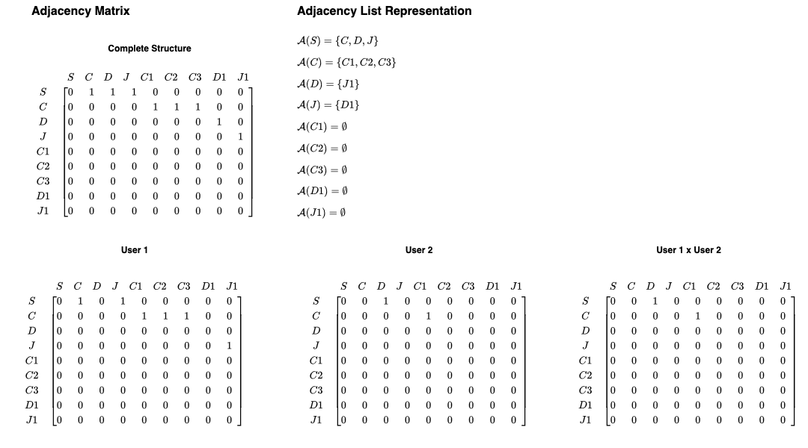

## GEO IAM

An Identity and Access Management (IAM) service for Geo Systems

## Getting Started

Require at least:

* NodeJS `22.12.0`

Run the command below to install global package for entire workspace:

```shell
npm install
```

### API

N.B. Never commit the .env file to the repo. Reproduce it from the template below.
`.development.env` is only included for this demonstration purposes.

Required parameters:
```text
DATABASE_NAME=
DATABASE_USERNAME=
DATABASE_PASSWORD=
```

Deploy the local DB and networking infrastructure:

```shell
docker compose up
```

Execute and build the system from source:

Run in development mode
```shell
npm run dev --workspace=packages/api
```
Run in development and continuously build
```shell
npm run dev:watch --workspace=packages/api
```
Build the production source in dist folder
```shell
npm run start --workspace=packages/api
```

Follow similar instructions in `frontend` folder to run the React project locally.

### UI

Then you can run locally with:
```shell
npm run dev --workspace=packages/config
```

Note: I am not taking a risk with Bun, as I feel it is still to new, while packages are catching up.

## Running tests

Unit tests
Only 3/9 passing test.
```shell
npm run test --workspace=packages/api
```

End-to-end tests

31 passing test!

**NB** Run this to also set up the test cases for all table records! 

A separate testing DB is not allocated yet and is not reset after each test run.

The policy should be updated as a rhythm for the development is found.
```shell
npm run test:e2e --workspace=packages/api
```

Test coverage
```shell
npm run test:cov --workspace=packages/api
```

Run with the --workspace to run test command across the entire system!

## Deployment Local

```shell
docker build -t geo-iam .
docker run -p 8080:8080 geo-iam
```

## Design Methodology

### People

People can be located in access-role structures defined by these Levels:

```text
0: Suburb
1: Wards
2: Districts/Counties
3: Province/State
4: Country
5: Continent/Regions 
6: Planetary
```

Should use graph theory and adjacency lists to solve the access comparison problem.


Graph properties:

* It is **Sparse**: there is only one path between any two nodes and to the top-level node, from path to root.
* **Directed Tree Graph**: edges have direction.
* **Rooted Tree**: single starting point.
* **Planar**: edges do not cross.
* **Bipartite**: graph can be divided without the halves sharing any edges.
* **Acyclic**: no loops; thus, a diagonal-free matrix structure is observed.
* **Top-Down Ordering**: arrange the nodes as an **upper triangular adjacency matrix**:
  * To display a readable matrix hierarchical format.
  * Enable faster graph traversal and access checks.
  * Simplify and optimize any graph computation.
  * Reduce storage space for future improvements.



Graph Operations:
* Use adjacency list to show which each node connects to, can be multiple connections to all children
* Use inverted adjacency list or parent map to show the parent for each node, can only be a single connection
  * Used for path to root and backtracking
* Depth-First Search (DFS)
  * Explore deep first
* Breadth-First Search (BFS)
  * Explore level by level
* Use element-wise multiplication to find overlying access between two users

### Process

#### ERD

See the Entity-Representation Diagram for our DB.
Columns and Tables in orange are for future improvements.


The DB design follows a Fourth Normal Form (4NF):
 1. No repeating groups
 2. No partial dependencies (i.e. no composite keys, only single primary keys)
 3. No transitive dependencies (i.e. no non-key columns should only depend on the primary key, no indirect links)
 4. No multivalued dependencies (i.e. no column contains duplicate values linked to the same primary key)

### Product

Nodejs monorepo workspace with two project.

1. Nextjs Back-end

* Folder: `packages/api`
* Swagger OpenAI Documentation available under: http://localhost:8080/docs
* Important packages:
  * @nestjs
  * Nestjs CRUD generator
  * @nestjs/swagger
  * @nestjs/typeorm typeorm mysql2
* The roles controller is the most important and will provide all the APIs and services for an expanded system to use.
* See the `users/{userid}/structures` and `areas/{areasid}/users` API for the buildings blocks to 
complete the adjacency lists and the main PROBLEM!

2. React Front-end:

* Folder: `packages/ui`
* Tailwind CSS and daisyUI components
* Important packages:
  * axios (http client)
  * Area selection UI with Leaflet and OpenStreetMap: https://react-leaflet.js.org

### Platform

Use Docker container for local development.

Use GCP (Google Cloud Platform) for all production hosting services:

1. Cloud Run for the server, to automatically scale instances based on load
2. Google CDN to serve the front-end

## Future Improvements

Activate OAUTH with @nestjs/passport to control the access of each API controller.

Consider using TypeORM structure presented here: https://github.com/slaviqueue/typeorm-pg-adjacency-list-tree

Add much more tests! Ensure 100% coverage for all service and end-to-end tests.

Extend the configuration system to support DevOps pipelines, i.e. environmental variables in docker compose.

Apply ParseIntPipe globally.

Convert area coordinates to more generic GeoJson format (https://geojson.org/), to also include polygon.

Add temporal table to the roles table (and possibly other tables) for auditable history logs.
This Postgres script works great and is deployable for cloud DBs where are not all the extension are supported:
https://github.com/nearform/temporal_tables

Get React-daisyUI to work with daisyui v5 (might need to personally contribute to project).

Complete the map marker integration improve area coordinate input. 
Store area coordinates in an optimised GIS format in the DB

Add a Github action to build and deploy!

Extended the levels to the hierarchy below, for scalable permission mapping around the world:
Provide more area definitions per country:
* South Africa: https://www.demarcation.org.za/ward-delimitation-2019-2020/
